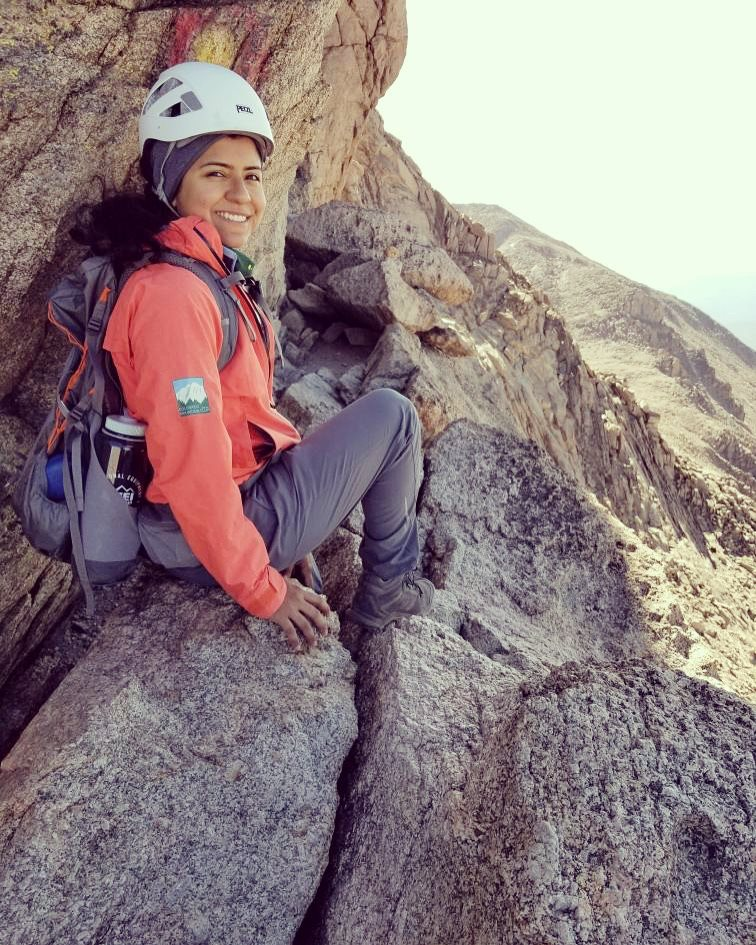
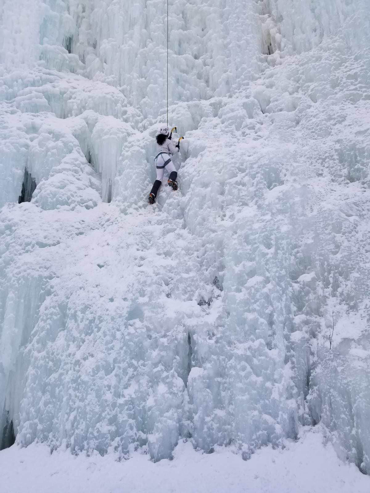
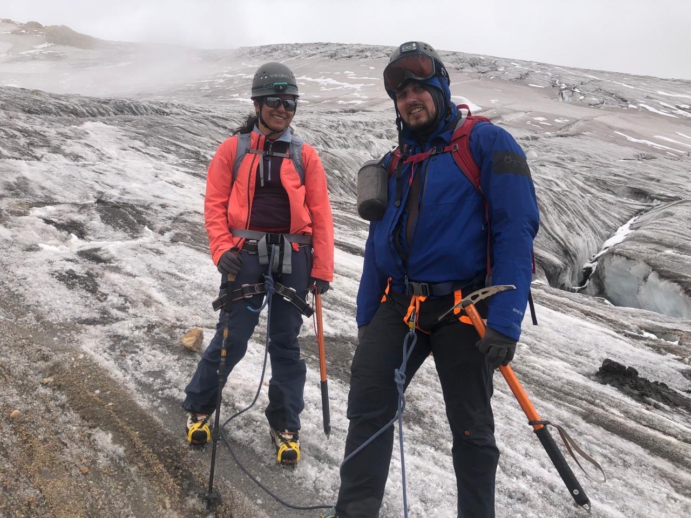
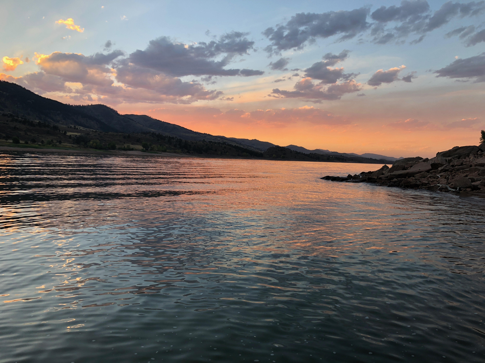

<link rel="stylesheet" type="text/css" href="styles.css">

# Andrea Méndez Colmenares, MD, PhD

## About Me

I’m a medical doctor from Maracaibo, Venezuela, with a Ph.D. in Cognitive Neuroscience from Colorado State University, USA. My PhD research employed advanced MRI techniques and focused on the decline and plasticity of white matter in aging populations. Throughout my Ph.D., I developed expertise in structural neuroimaging, lifestyle factors affecting white matter health, cognitive assessments, and psychometrics. I have a track record of collaboration and leadership in academic settings both in Venezuela and the US. In the summer of 2024, I will be starting my neurology residency training. I hope to become a physician-scientist in the field of Alzheimer's and related dementias and continue advocating for underrepresented minorities in science and medicine.

## Links

- [Google Scholar](https://scholar.google.com/citations?user=e8jAPewAAAAJ&hl=en)
- [Twitter](https://x.com/andreamendez92)

## Media Coverage

- [The New York Times](https://www.nytimes.com/2021/07/14/well/move/exercise-walking-brain-memory.html)
- [Colorado State University News](https://chhs.source.colostate.edu/aerobic-exercise-boosts-healthy-brain-aging-csu-study-finds/)
- [Global UGRAD Exchange Program (2013)](https://www.wyomingnews.com/laramieboomerang/news/venezuelan-student-plays-guitar-at-spring-wind/article_b99ddcec-91c9-552e-aac8-3b895906c2bc.html) _(Old but meaningful)_

## Guides

- [Research Tips Guide for IMGs](https://www.amwa-doc.org/wp-content/uploads/2024/01/AMWA-IMG-NMatch2024-Research-Tips-Guide_Jan2024.pdf)

## Gallery

### Climbing and Adventures

### Horsetooth, Fort Collins, CO

<footer>
    &copy; 2024 Andrea Méndez Colmenares
</footer>
